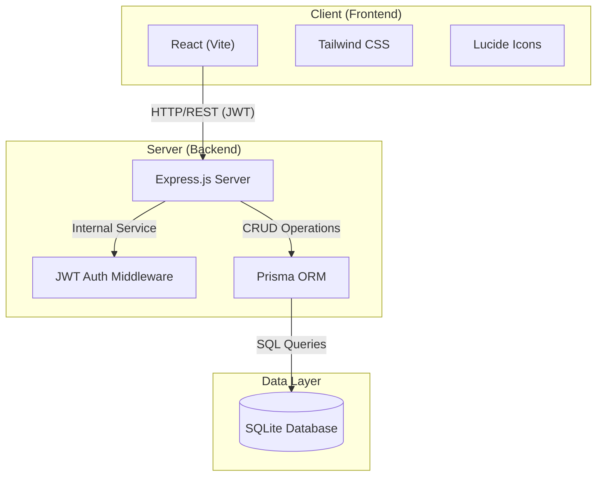

# System Architecture

The Logistics Maintenance System follows a classic 3-tier web architecture designed for modularity and ease of deployment.

## High-Level Architecture

## Component Breakdown

### 1. Frontend (React)
- **SPA Architecture**: Single Page Application using `react-router` for navigation.
- **State Management**: Primarily local component state and React Context for authentication.
- **API integration**: A custom `api.ts` utility handles all REST communication with the backend.

### 2. Backend (Express.js)
- **RESTful API**: Standardized JSON endpoints for all resources.
- **Security Layer**: All routes except `/auth` are protected by a JWT verification middleware.
- **ORM (Prisma)**: Provides type-safe database queries and automated schema migrations.

### 3. Database (SQLite)
- **Portable**: The entire database is stored in a single file (`/server/prisma/dev.db`), making it ideal for university project submissions and local development.
- **Relational**: Enforces data integrity through foreign key constraints (e.g., ensuring a maintenance request is always linked to existing equipment).
