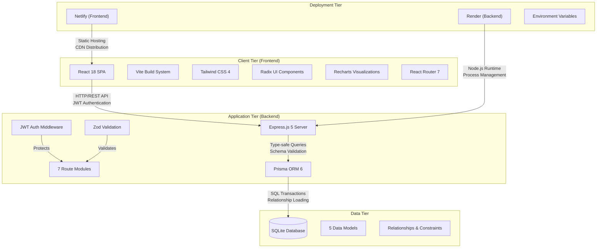

# System Architecture

The Logistics Maintenance Management System follows a modern 3-tier web architecture designed for modularity, scalability, and ease of deployment. This architecture separates concerns between presentation, business logic, and data persistence layers.

## High-Level Architecture

## Component Breakdown

### 1. Frontend Tier (React SPA)

**Architecture Pattern:** Single Page Application (SPA) with client-side routing
- **React 18**: Modern React with hooks and functional components
- **Vite**: Next-generation frontend tooling for fast development and optimized builds
- **TypeScript**: Full type safety across the entire frontend codebase
- **React Router 7**: Declarative routing with protected route implementation

**State Management:**
- **React Context**: Global authentication state (`AuthContext`)
- **Local State**: Component-level state for forms and UI interactions
- **API State**: Server state managed through `useEffect` hooks and API calls

**UI Components:**
- **40+ Radix UI Components**: Unstyled, accessible primitives with custom styling
- **Recharts**: Interactive data visualizations (pie charts, bar graphs, tooltips)
- **Lucide React**: Consistent icon system throughout the application
- **Tailwind CSS 4**: Utility-first CSS framework with custom design system

**API Integration:**
- **Centralized API Client**: `api.ts` utility with token injection and error handling
- **Environment Configuration**: `VITE_API_URL` for flexible backend targeting
- **Request/Response Interceptors**: Automatic JWT header injection and error parsing

### 2. Application Tier (Express.js Backend)

**Server Architecture:** RESTful API with middleware pipeline
- **Express.js 5**: Minimalist web framework for Node.js
- **TypeScript**: Full backend type safety with strict configuration
- **Modular Routing**: 7 separate route modules for clear separation of concerns
- **Middleware Pipeline**: Request processing through authentication, validation, and logging

**Security Layer:**
- **JWT Authentication**: Token-based stateless authentication with 24-hour expiration
- **bcryptjs Password Hashing**: Secure password storage with salt rounds
- **Role-Based Authorization**: `authorizeRole` middleware for route protection
- **CORS Configuration**: Cross-origin resource sharing for frontend-backend communication

**Validation & Business Logic:**
- **Zod Schema Validation**: Runtime validation for all API request bodies
- **Input Sanitization**: Protection against injection attacks
- **Business Rules Enforcement**: Role-based permissions, cascade deletion, unique constraints
- **Error Handling**: Consistent error responses with appropriate HTTP status codes

**Route Modules:**
1. **Auth Routes** (`/api/auth`): User registration, login, profile retrieval
2. **Maintenance Routes** (`/api/maintenance`): CRUD operations with technician assignment
3. **Equipment Routes** (`/api/equipment`): Asset registry management
4. **Inventory Routes** (`/api/inventory`): Stock tracking and low-stock alerts
5. **Requisition Routes** (`/api/requisitions`): Supply request workflow
6. **Dashboard Routes** (`/api/dashboard`): Aggregated statistics for visualization
7. **User Routes** (`/api/users`): User management (Admin only)

### 3. Data Tier (SQLite with Prisma ORM)

**Database Design:** Relational database with proper normalization
- **SQLite**: File-based database ideal for demonstrations and portable deployments
- **Prisma ORM**: Type-safe database access with auto-generated client
- **5 Data Models**: User, Equipment, MaintenanceRequest, Requisition, InventoryItem
- **Relationships**: Proper foreign key constraints with cascade deletion

**Schema Features:**
- **UUID Primary Keys**: String-based identifiers for all records (except User)
- **Automatic Timestamps**: `createdAt` and `updatedAt` fields managed by Prisma
- **Enum-like Fields**: Status fields with constrained values (Operational, Pending, etc.)
- **Nullable Relationships**: Optional technician assignment in maintenance requests

**Data Integrity:**
- **Foreign Key Constraints**: Ensures referential integrity across relationships
- **Unique Constraints**: Prevents duplicate email addresses
- **Cascade Deletion**: Equipment deletion removes related maintenance records
- **Default Values**: Automatic status assignment and timestamp generation

**Performance Optimizations:**
- **Eager/Lazy Loading**: Prisma `include` statements for relationship loading
- **Query Optimization**: Proper indexing on frequently queried fields
- **Connection Pooling**: Prisma client connection management
- **Transaction Support**: Atomic operations for data consistency

### 4. Deployment Tier (Netlify + Render)

**Split Architecture:** Frontend and backend deployed separately for optimal performance
- **Netlify (Frontend)**: Static site hosting with global CDN, automatic SSL, and CI/CD
- **Render (Backend)**: Node.js hosting with automatic deployments from Git
- **Environment Configuration**: Secure management of API keys and secrets

**Deployment Configuration:**
- **Frontend Build**: Vite production build with optimized assets
- **Backend Build**: TypeScript compilation and Prisma client generation
- **Database Migration**: Schema synchronization and seed data population
- **Health Checks**: Automatic monitoring and restart on failure

**Scalability Considerations:**
- **Horizontal Scaling**: Stateless backend allows multiple instances
- **Database Options**: SQLite for demos, PostgreSQL for production persistence
- **CDN Caching**: Static assets served from edge locations
- **Load Balancing**: Multiple backend instances behind load balancer (production)

### 5. Development & Tooling

**Development Environment:**
- **Hot Reloading**: Vite dev server for frontend, ts-node-dev for backend
- **Type Checking**: Full TypeScript validation across both tiers
- **Database Tools**: Prisma Studio for visual database management
- **API Testing**: REST client tools (Postman, Insomnia, curl)

**Build Process:**
- **Frontend**: `npm run build` → Vite production optimization
- **Backend**: `npm run build` → TypeScript compilation
- **Database**: `npx prisma migrate dev` → Schema migration
- **Seeding**: `npx prisma db seed` → Test data population

**Quality Assurance:**
- **Manual Testing**: Comprehensive test scenarios for all user flows
- **Performance Testing**: Sub-500ms dashboard response time requirement
- **Security Testing**: Authentication, authorization, and input validation
- **Usability Testing**: Responsive design across device sizes

## System Characteristics

### Reliability
- **Transaction Support**: Atomic database operations
- **Error Recovery**: Graceful error handling with user-friendly messages
- **Data Backup**: SQLite file backup strategy for critical data
- **Health Monitoring**: API health check endpoints

### Maintainability
- **Modular Structure**: Clear separation between frontend, backend, and database
- **Comprehensive Documentation**: SRS, ERD, use cases, API docs, deployment guide
- **Code Organization**: Consistent file structure and naming conventions
- **Configuration Management**: Environment-based configuration

### Security
- **Authentication**: JWT with expiration and secure storage
- **Authorization**: Role-based access control with middleware protection
- **Input Validation**: Zod schemas for all API endpoints
- **Password Security**: bcryptjs hashing with salt rounds

### Performance
- **Frontend Optimization**: Code splitting, tree shaking, asset optimization
- **Backend Optimization**: Efficient database queries with proper indexing
- **Caching Strategy**: Browser caching for static assets
- **Lazy Loading**: On-demand component and data loading

This architecture provides a solid foundation for a production-ready logistics management system while remaining accessible for university project evaluation and demonstration.
