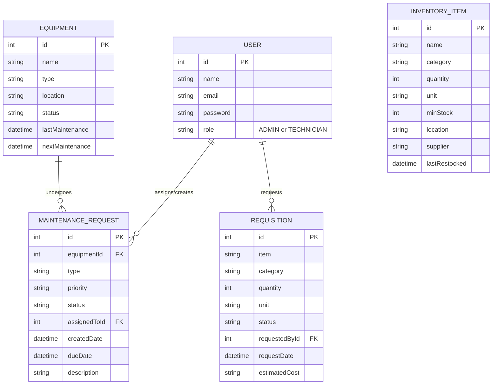

# Entity Relationship Diagram (ERD)

This diagram shows the database structure and relationships for the Logistics Maintenance System.

```mermaid
erDiagram
    USER ||--o{ MAINTENANCE_REQUEST : "assigns/creates"
    USER ||--o{ REQUISITION : "requests"
    EQUIPMENT ||--o{ MAINTENANCE_REQUEST : "undergoes"
    USER {
        int id PK
        string name
        string email
        string password
        string role "ADMIN or TECHNICIAN"
    }
    EQUIPMENT {
        int id PK
        string name
        string type
        string location
        string status
        datetime lastMaintenance
        datetime nextMaintenance
    }
    MAINTENANCE_REQUEST {
        int id PK
        int equipmentId FK
        string type
        string priority
        string status
        int assignedToId FK
        datetime createdDate
        datetime dueDate
        string description
    }
    REQUISITION {
        int id PK
        string item
        string category
        int quantity
        string unit
        string status
        int requestedById FK
        datetime requestDate
        string estimatedCost
    }
    INVENTORY_ITEM {
        int id PK
        string name
        string category
        int quantity
        string unit
        int minStock
        string location
        string supplier
        datetime lastRestocked
    }
```
