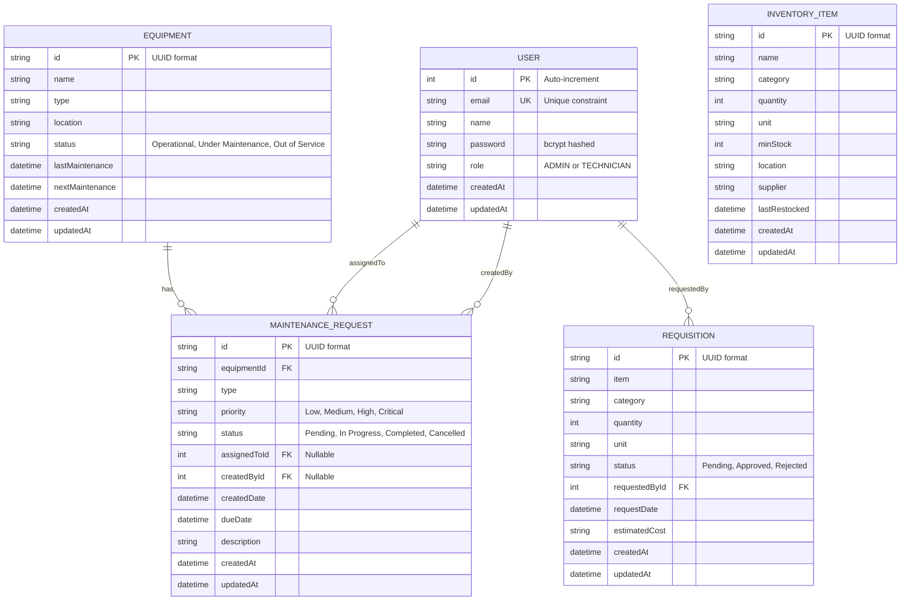

# Entity Relationship Diagram (ERD)

This diagram shows the complete database structure and relationships for the Logistics Maintenance Management System. The system uses SQLite with Prisma ORM and includes 5 primary data models with proper relationships and constraints.

## Complete Database Schema

## Relationship Details

### User Relationships
- **User → MaintenanceRequest (createdBy)**: One-to-many, a user can create multiple maintenance requests
- **User → MaintenanceRequest (assignedTo)**: One-to-many, a technician can be assigned multiple maintenance tasks
- **User → Requisition**: One-to-many, a user can request multiple requisitions

### Equipment Relationships
- **Equipment → MaintenanceRequest**: One-to-many, equipment can have multiple maintenance records
- **Cascade Deletion**: When equipment is deleted, all related maintenance requests are also deleted

### Key Constraints
1. **Unique Constraints**: Email must be unique across all users
2. **Foreign Key Constraints**: All relationships enforce referential integrity
3. **Cascade Deletion**: Equipment deletion cascades to maintenance requests
4. **Nullable Fields**: assignedToId and createdById can be null in MaintenanceRequest

### Field Descriptions

**User Model:**
- `id`: Auto-incrementing primary key
- `email`: Unique identifier for login
- `password`: Hashed using bcryptjs with salt rounds
- `role`: Either "ADMIN" or "TECHNICIAN" with role-based permissions
- `createdAt/updatedAt`: Automatic timestamp management

**Equipment Model:**
- `id`: UUID string for unique identification
- `status`: Three-state enum (Operational, Under Maintenance, Out of Service)
- `lastMaintenance/nextMaintenance`: Maintenance scheduling fields

**MaintenanceRequest Model:**
- `priority`: Four-level priority system
- `status`: Four-state workflow (Pending → In Progress → Completed/Cancelled)
- `assignedToId`: References technician assigned (nullable)
- `createdById`: References user who created request (nullable)

**Requisition Model:**
- `status`: Three-state approval workflow
- `estimatedCost`: String field for cost estimation
- `requestedById`: Mandatory reference to requesting user

**InventoryItem Model:**
- `minStock`: Threshold for low-stock alerts
- `lastRestocked`: Timestamp of last inventory restock
- `supplier`: Vendor/supplier information

## Database Operations

### Supported Operations
1. **Create**: All models support creation with validation
2. **Read**: Optimized queries with proper indexing
3. **Update**: Timestamp auto-update on modification
4. **Delete**: Cascade deletion for equipment-maintenance relationship

### Validation Rules
- Email format validation during registration
- Password strength requirements (minimum 6 characters)
- Role validation (only "ADMIN" or "TECHNICIAN" allowed)
- Quantity validation (non-negative integers)
- Date validation (due dates cannot be in the past)

### Performance Considerations
- Indexes on frequently queried fields (email, status, equipmentId)
- Efficient relationship loading with Prisma include statements
- Pagination support for large datasets
- Caching for frequently accessed dashboard statistics
